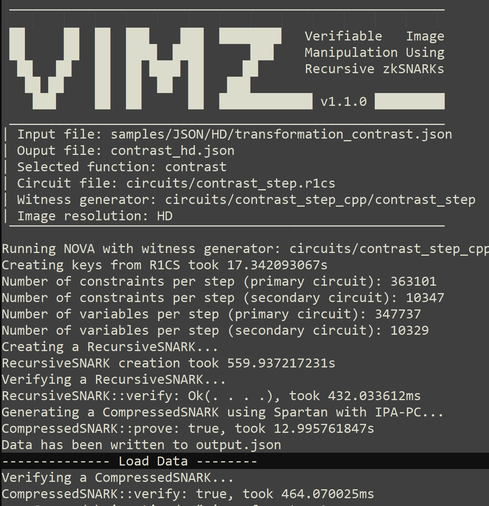
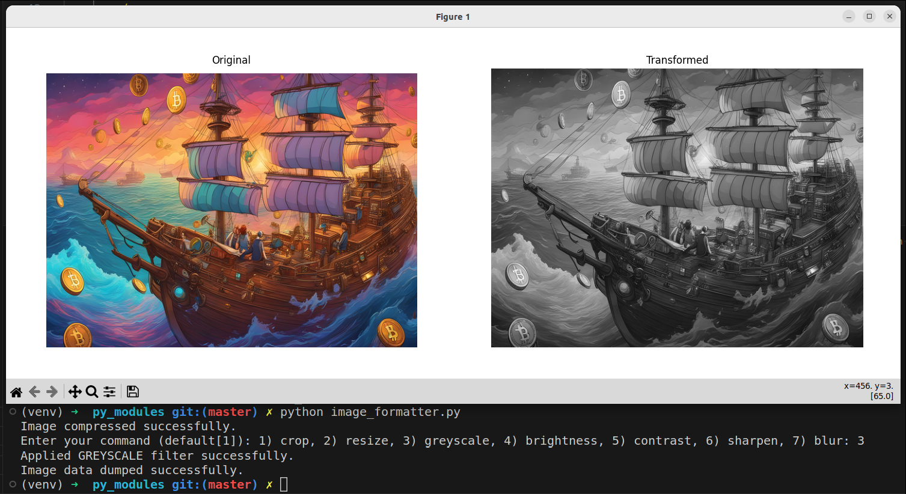

# **VIMz**: Verifiable Image Manipulation via Folding-based zkSNARKs [](https://doi.org/10.5281/zenodo.12516128)

<p align="center">
  
  <em>Cover generated by <a href="https://www.freepik.com"> FreePik </a></em>
</p>

## **Brief Description:**


Making sure that images shared online are authentic and trustworthy is a big challenge. But let's be real: most images need some tweaking before they go public. **Zero-knowledge proofs (ZKPs)** can help by verifying edited images without needing to reveal the original. The problem? ZKPs are often costly, especially when it comes to prover complexity and proof size. That's where [**VIMz**](https://github.com/zero-savvy/vimz) comes in. VIMz is a framework designed to prove the authenticity of high-resolution images efficiently using _folding-based zkSNARKs_ (powered by the [Nova](https://github.com/microsoft/Nova) proving system). With VIMz, we can verify that both the original and edited images are legit, along with the correctness of the transformations, all without revealing any intermediate versions—only the final image is exposed. Plus, VIMz keeps the identities of the original creator and subsequent editors private while proving the final image's authenticity, making it ideal for privacy-preserving, trustless marketplaces compatible with C2PA standards. It's efficient enough to handle 8K images on a mid-range laptop with minimal memory and proof size, offering fast verification and parallel processing capabilities. We formally prove the security of VIMz on our recent [paper](https://eprint.iacr.org/2024/1063).


##  **Core Idea:**

To address the prover complexity in _"proofs of media provenance,"_ we utilized the efficiency of folding schemes, specifically the [Nova](https://github.com/microsoft/Nova) protocol. More precisely, we leverage [Circom](https://github.com/iden3/circom) to define our folding steps in Nova via the [Nova-Scotia](https://github.com/nalinbhardwaj/Nova-Scotia) frontend. To ensure everything works securely, we developed a new commitment scheme for images, processing them row by row. This approach allows us to map any image transformation to a **_"folding-friendly"_** version that can be proven in Nova while also proving the commitment of the witness, i.e., the original image. For more details on the exact protocol and the formal security analysis of VIMz, refer to our recent [paper](https://eprint.iacr.org/2024/1063). With VIMz, we can verify both the original and edited images, as well as the correctness of the transformations, without revealing intermediate versions—only the final image is shown. Additionally, VIMz protects the identities of both the original creator and subsequent editors while proving the authenticity of the final image.

Our tests show that VIMz is fast and efficient on both the prover and verifier sides. For example, you can prove transformations on **8K (33MP) images** using just **a mid-range laptop**, hitting a peak memory usage of **10 GB**. Verification takes **less than 1 second**, and proof sizes come in at **under 11 KB** no matter the resolution. Plus, the low complexity of VIMz means you can prove multiple transformations in parallel, boosting performance by up to **3.5x** on the same machine.

## Reference

If you have used this repo to develop a research work or product, please cite our paper:

1) **PETS conference Paper:** **[2025]** S. Dziembowski, S. Ebrahimi, P. Hassanizadeh, [VIMz: Private Proofs of Image Manipulation using Folding-based zkSNARKs](https://eprint.iacr.org/2024/1063)

   ```
    @inproceedings{vimz25pets,
      title     = {VIMz: Private Proofs of Image Manipulation using Folding-based zkSNARKs},
      author    = {Dziembowski, Stefan and Ebrahimi, Shahriar and Hassanizadeh, Parisa},
      booktitle = {Proceedings on Privacy Enhancing Technologies (PoPETs},
      address   = {Mountain View, CA},
      month     = {July},
      year      = 2025
    }
    ```

## Performance

Following table provides performance measurements of VIMz executed separately on two different devices (Core-i5 Laptop and a Ryzen 9 Server), while proving transformations on an HD resolution image.
We have executed multiple runs using different input values and reported the average performance in the following table. However, we note that in all of our runs we observed very high consistency between the results. More detailed analysis are available in the paper:

| Transformation | Related Circom Circuit for the steps in Nova | Mid-range Laptop (Key. Gen.) | Mid-range Laptop (Proving) | Server (Key. Gen.) | Server (Proving) | Peak Memory |
|----------------|-------------------------|------------------------------|----------------------------|--------------------|------------------|-------------|
| Crop           | optimized_crop_step_HD  | 3.8 s                        | 187.1 s                    | 3.5 s              | 133.0 s          | 0.7~GB      |
| Resize         | resize_step_HD          | 11.5 s                       | 187.0 s                    | 6.6 s              | 135.7 s          | 2.5 GB      |
| Contrast       | contrast_step_HD        | 11.7 s                       | 479.4 s                    | 6.5 s              | 371.7 s          | 2.4 GB      |
| Grayscale      | grayscale_step_HD       | 8.2 s                        | 279.6 s                    | 3.7 s              | 240.6 s          | 1.3 GB      |
| Brightness     | brightness_step_HD      | 11.3 s                       | 474.0 s                    | 6.5 s              | 372.5 s          | 2.4 GB      |
| Sharpness      | sharpness_step_HD       | 11.8 s                       | 614.1 s                    | 6.8 s              | 455.8 s          | 2.8 GB      |
| Blur           | blur_step_HD            | 11.5 s                       | 555.3 s                    | 6.6 s              | 406.0 s          | 2.5 GB      |

> [!NOTE]
> We have two implementations of `crop`, by default we run the `optimizaed_crop` version in our benchmarks, which has a fix starting point for the crop. However, the other version of our `crop` circuit supports arbitrary starting point that we refer to it in the paper as **selective crop**, which is far morecomplex than the `optimized crop` circuit. You can find the circuits for each version below:
> - Static/Fixed Crop: `circuits/optimized_crop_HD.circom` and `circuits/optimized_crop_4K.circom`
> - Selective Crop: `circuits/crop_HD.circom` and `circuits/crop_4K.circom`

## Directories
The repository is organized into four directories:

- **circuits:** Contains the underlying ZK circuits of VIMz in `circom` language.

- **contracts:** Contains high-level Solidity smart contracts~(see Appendix F C2PA-Compatible Marketplace) that provide the infrastructure for a C2PA-compatible marketplace on EVM-based blockchains.

- **nova:** Contains the main `cargo`-based package for building and installing VIMz using `nova` protocol.

- **py\_modules:** Houses the Python interface (GUI) of VIMz, facilitating image editing and preparation of input files for the VIMz prover.

- **samples:** Holds images in standard resolutions (e.g., HD, 4K) along with pre-built `JSON` files of supported edits to be fed into the VIMz prover.

## Installation

### I-Dependencies

 - **I-a) Node JS**:
   - `curl -o- https://raw.githubusercontent.com/nvm-sh/nvm/v0.39.3/install.sh | bash`
   - `source ~/.bashrc`
   - `nvm install v16.20.0`
> [!TIP]
> in rare cases (miss-configured Linux distros), if you got an error stating that version "v16.20.0" was not found; following command might help:
> `export NVM_NODEJS_ORG_MIRROR=http://nodejs.org/dist`

  - **I-b) snarkjs**:
    - `npm install -g snarkjs`
  - **I-c) Rust**:
    - `curl --proto '=https' --tlsv1.2 -sSf https://sh.rustup.rs | sh -s -- --default-toolchain none -y`
    - `rustup default stable`
  - **I-d) build-essentials:**
    - `sudo apt install gcc build-essential nlohmann-json3-dev libgmp3-dev nasm`
  - **I-e) Circom**:
    - `git clone https://github.com/iden3/circom.git`
    - ` cd circom`
    - `cargo build --release`
    - `cargo install --path circom`
    - Verify the installation: `circom --version`
  - **I-f) Time**:
    - `sudo apt install time`

> [!NOTE]
> We have successfully executed benchmarks on multiple systems and expect there should be minimal sensitivity regarding spesific versions in the dependencies, however, we note one of our recent system configurations for the record:
> - Ubuntu @ 22.04
> - Circom @ 2.2.1
> - snarkjs @ 0.7.5
> - rustc @ 1.86.0-nightly

### II-Installing VIMz

Once you have installed dependencies, you can proceed with setting up and running VIMz. 
To obtain the latest version of VIMz, head to directory of your choice and install VIMz using the following command:

  - Clone: `git clone https://github.com/zero-savvy/vimz.git`
  - Head to the `nova` directory: `cd vimz/nova`
  - build and install `vimz` using `cargo`:
    - `cargo build`
    - `cargo install --path .`
    - verify installation of `vimz`: `vimz --help`

#### II-b) Building Circuits

  - go to the circuits directory: `cd ../circuits`
  - build node modules: `npm install`
  - build ZK circuits using the provided script in this directory:
    - Circuit-spesific build: `./build_circuits.sh grayscale_step_HD.circom` or `./build_circuits.sh contrast_step_4K.circom`
    - Full build: `./build_circuits.sh`
> [!NOTE]
> If you only want to reproduce results, we suggest to only build a few circuits, because building all of the circuits can take some time! It's not that long, but why wait? :D


## Benchmarks

We've built the tools necessary for benchmarking using the samples provided in the `samples` directory. To do this,
simply Go to the main directory of vimz repo and run any number of transformations as you prefer using the provided script:

```
./benchmark.sh <resolution> [list-of-transformations]

```
> [!IMPORTANT]
> Make sure that the circuit related to the benchmarking transformation must be already built (check [**II-b Building Circuits**](README.md#ii-b-building-circuits) section).

> [!TIP]
> Since the proof generation process can be time consuming, it is recommended to initially benchmark with only one transformation at a time (replicating the HD resolution results presented in _**Table 4**_ of the paper). Once these results are verified, you can proceed to run multiple transformations in parallel to replicate the results shown in _**Table 5**_.

**Example 1**: benchmarking a single transformation:

```
./benchmark.sh HD contrast
     or
./benchmark.sh 4K blur
     or
./benchmark.sh HD grayscale
```

**Example 2**: benchmarking parallel execution of multiple transformations:

```
./benchmark.sh HD contrast blur
     or
./benchmark.sh 4K resize blur sharpness
```

> [!TIP]
> **Reproducing Parallel Experiments:** You can easily reproduce the benchmarks reported in the Table 5 of the paper using the script. Just add the list of transformations according the entry you want to reproduce from Table 5. For instnce, in order to run the experiment ofr the `Cn-Sh-Re` entry, you should run `./benchmark.sh HD contrast sharpness grayscale`.


> [!IMPORTANT]
> **Sample output**: When benchmarking only one transformation, the output will be visible in the `stdout`. However, while benchmarking parallel execution of multiple transformations, the script generates a file (or multiple files, one per given transformation) with a `.output` suffix in the same directory. These files contain the standard output of running the `vimz` command directly, as shown in Figure below. Nonetheless, the output includes various performance metrics.
> - The total proof generation time can be calculated as the sum of two numbers: `RecursiveSNARK creation` and `CompressedSNARK::prove:` from the output. 
> - `CompressedSNARK::verify:` represents the verification time.

<p align="center">
  
  <em>VIMz STD output</em>
</p>


## How to Use
Other than benchmarking, if you want to execute VIMz directly, it should be done using the following command. For more details of running VIMz, use `vimz --help`:

```
vimz --function <FUNCTION>
--resolution <RESOLUTION> --input <FILE>
--circuit <R1CS FILE> --output <FILE>
--witnessgenerator <BINARY/WASM FILE>
```

## Python Image Editor
We've provided a python GUI to apply the effects on the given images. You canfind it in `py_modules` directory. 
1. When running it, a `tkinter`-based file picker will open to select the input image, which must be exactly in HD or 4K resolution. You can also use the sample images provided in the `samples` directory.
2. After this, the script will take a little time to digest the image and create propoer inputs for the Nova prover.
3. Then the script will as to select the edit you wish to apply on the image: `Enter your command: 1) crop 2) resize ... 7) blur`, which can be done by inputting a number related to the transformation you want. For instance `2` for applying `resize`.
4. Based on the selected effect, the script might ask for other configs, such as the _ratio_ for the `contrast` or `sharpness`.
5. The script then views the image and the applied effect in a new window. See the figure below as an example. 
6. After closing the window, the script will work on applying the transfomation and creating the final JSON file for your image eefect to be proven with VIMz. The JSON file should follow the exact structure as the sample JSON files available in the `samples/` directory. 

<p align="center">
  
  <em>GUI for the pythn_formatter.py</em>
</p>

## Acknowledgement

1. We thank [@iden3](https://github.com/iden3) for building the awesome [Circom](https://github.com/iden3/circom) language and providing the [CircomLib](https://github.com/iden3/circomlib).
2. This work currently heavily relies on [Nova-Scotia](https://github.com/nalinbhardwaj/Nova-Scotia)'s compiler for transforming Circom circuits to the ones compatible with [Nova](https://github.com/microsoft/Nova).
3. The very early version of the project (solely based on Circom without NOVA) was inspired by image transformation proofs from [@TrishaDatta](https://github.com/TrishaDatta)'s Circom circuits [repository](https://github.com/TrishaDatta/circom-circuits),<br>
   which were related to the [medium post](https://medium.com/@boneh/using-zk-proofs-to-fight-disinformation-17e7d57fe52f) By Trisha Datta and Dan Boneh.

## License

<p xmlns:cc="http://creativecommons.org/ns#" >This work is licensed under <a href="http://creativecommons.org/licenses/by-nc/4.0/?ref=chooser-v1" target="_blank" rel="license noopener noreferrer" style="display:inline-block;">Attribution-NonCommercial 4.0 International 
 </a></p>
