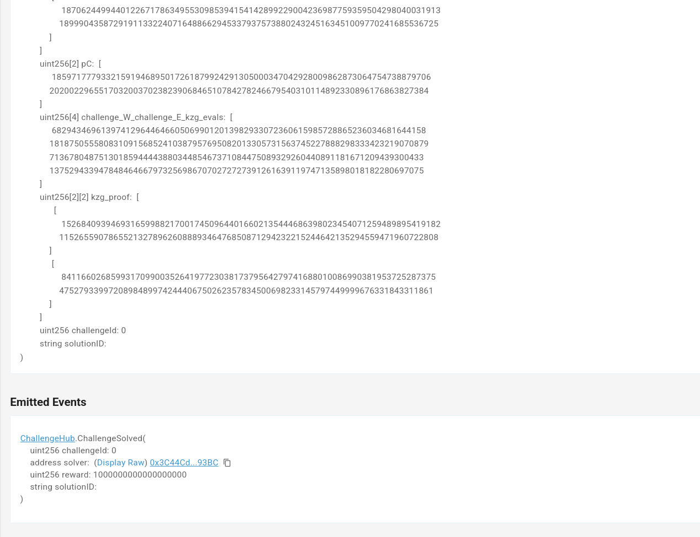

# Proof of Provenance: On-Chain Verification

## Summary

This is a demonstration of how the **VIMz** tool can be used to generate ZK proofs for image manipulation, which can then be verified **on-chain**, thanks to integration with the **Sonobe** library.

The showcase scenario involves two main actors:
- **Challenger**: Creates a challenge by publishing an image to IPFS and specifying a required transformation.
- **Solver**: Processes the image, applies the transformation, and generates a ZK proof of correctness using the VIMz tool.

A smart contract on an **EVM-based blockchain** governs the challenge. The solver submits their solution along with a ZK proof, and if the proof is valid, they receive a reward. The contract verifies the proof **on-chain** before approving the submission.

---

## Technical Details

### Contracts

#### Challenge Hub

The main contract is [`ChallengeHub.sol`](ChallengeHub.sol).
It acts as a registry for all challenges as described below.

- A challenge creator can call `createChallenge`, providing:
    - Source image ID (e.g., an IPFS identifier).
    - Proposed reward.
    - Required transformation.

- Once a challenge is published, solvers can submit their solutions by calling `submitSolution` with:
    - Challenge ID.
    - Solution image ID.
    - ZK proof of the transformation's validity.

The proof is verified **on-chain** using a **verifier contract** (see below).
The first solver to submit a valid solution receives the reward.

#### Verifier Contracts

Each transformation type has a **dedicated verifier contract**, generated by the **Sonobe** library.
Source codes are available in the [`verifier-contracts`](verifier-contracts/) directory.

### Image Registry

Since images are too large to be passed via calldata or stored on-chain, an off-chain storage solution is required.
This can be IPFS, Swarm, or any decentralized storage.

For this demo, a local IPFS node is used to store images.

### Off-Chain Tools

The off-chain components include:
- An image editor (a simple Python script).
- VIMz tool, used to generate ZK proofs, which are compatible with Sonobe verifiers.

All transformations are implemented as **Circom circuits**, located in the [`circuits`](../circuits/sonobe) directory.

---

## Running the scenario locally

### Requirements

1. You must be able to run VIMz tool together with its dependencies (like `Rust`, `Python3`, `Circom`, `Node`).
2. Foundry (https://book.getfoundry.sh/getting-started/installation).
3. IPFS (https://docs.ipfs.tech/install/command-line/).
4. Auxiliary tools like `jq`, `xxd`, `cut`.

You can check if you have all the necessary tools by running the following command:

```bash
./check-env.sh
```

In case you are missing some tools, the script will print out the instructions on how to install them.

### Launching the scenario

You can launch scenario by running `./scenario.sh`.
It will perform the following steps:
1. Check if all the required tools are available.
2. Install node dependencies (used in contract deployment).
3. Start a local Anvil node.
4. Build and deploy the contracts.
5. Create a challenge (upload an image to IPFS and create a challenge in the contract).
6. Solve the challenge (download the image, apply the transformation, generate a proof, and submit it to the contract).
7. Verify the solution on-chain and pay the reward.
8. Stop the Anvil node.

<details>
<summary>Example output</summary>

```
✅ Checking requirements and installing dependencies
✅ Anvil node started
✅ Contracts deployed
🚀 Creating challenge
  ✅ Challenge uploaded to IPFS with ID: QmRycz7eP5uzA2gjcjgGfFGE1Rou5p9jLamdfzgNR2k2ve
  ✅ Challenge created
🚀 Solving challenge
  ✅ Found challenge ID: QmRycz7eP5uzA2gjcjgGfFGE1Rou5p9jLamdfzgNR2k2ve
  ✅ Challenge fetched from IPFS
  ✅ Image processed
  ✅ Solution uploaded to IPFS with ID: QmfW3ALNaPqG1gZ3jmAgAMEbe1uVKvGkTDpUv6tMYiuVyV

 ________________________________________________________
                                                         
 ██     ██  ██  ███    ███  ████████   Verifiable  Image
 ██     ██  ██  ████  ████      ███    Manipulation from
  ██   ██   ██  ██ ████ ██     ██      Folded   zkSNARKs
   ██ ██    ██  ██  ██  ██   ███                         
    ███     ██  ██      ██  ████████████ v1.4.0 ████████
 ________________________________________________________
| Selected Backend: Sonobe
| Input file: "../on-chain-verification-showcase/blur.json"
| Output file: Some("../calldata/proof")
| Selected function: Blur
| Circuit file: "../circuits/sonobe/blur_step.r1cs"
| Witness generator: "../circuits/sonobe/blur_step_js/blur_step.wasm"
| Image resolution: HD
| Demo mode: true
 ‾‾‾‾‾‾‾‾‾‾‾‾‾‾‾‾‾‾‾‾‾‾‾‾‾‾‾‾‾‾‾‾‾‾‾‾‾‾‾‾‾‾‾‾‾‾‾‾‾‾‾‾‾‾‾‾
 INFO Prepare input: 126ms
 INFO Prepare folding:Create circuit: 119ms
 INFO Prepare folding:Preprocess Nova: 2.66s
 INFO Prepare folding:Init Nova: 1.60s
 INFO Prepare folding: 4.38s
 INFO Fold input{steps=10}:Fold step{completed=0}: 1.86s
 INFO Fold input{steps=10}:Fold step{completed=1}: 1.62s
 INFO Fold input{steps=10}:Fold step{completed=2}: 1.97s
 INFO Fold input{steps=10}:Fold step{completed=3}: 1.99s
 INFO Fold input{steps=10}:Fold step{completed=4}: 1.99s
 INFO Fold input{steps=10}:Fold step{completed=5}: 1.99s
 INFO Fold input{steps=10}:Fold step{completed=6}: 1.95s
 INFO Fold input{steps=10}:Fold step{completed=7}: 1.98s
 INFO Fold input{steps=10}:Fold step{completed=8}: 1.99s
 INFO Fold input{steps=10}:Fold step{completed=9}: 1.99s
 INFO Fold input{steps=10}: 19.3s
 INFO Verify folded proof: 84.5ms
 INFO Prepare decider: 19.4s
 INFO Generate decider proof: 19.7s

  ✅ Proof computed
  ✅ Solution submitted
✅ Scenario successfully run
✅ Stopped running anvil node

```
</details>

### Observing the results

You can also connect some frontend explorer, like [Ethernal](https://tryethernal.com/), to the local node to see the transactions and the contract state.

Challenge creation event |  Solution submission event | Solution submission event (continued)
:-------------------------:|:-------------------------:|:-------------------------:
  |   |
